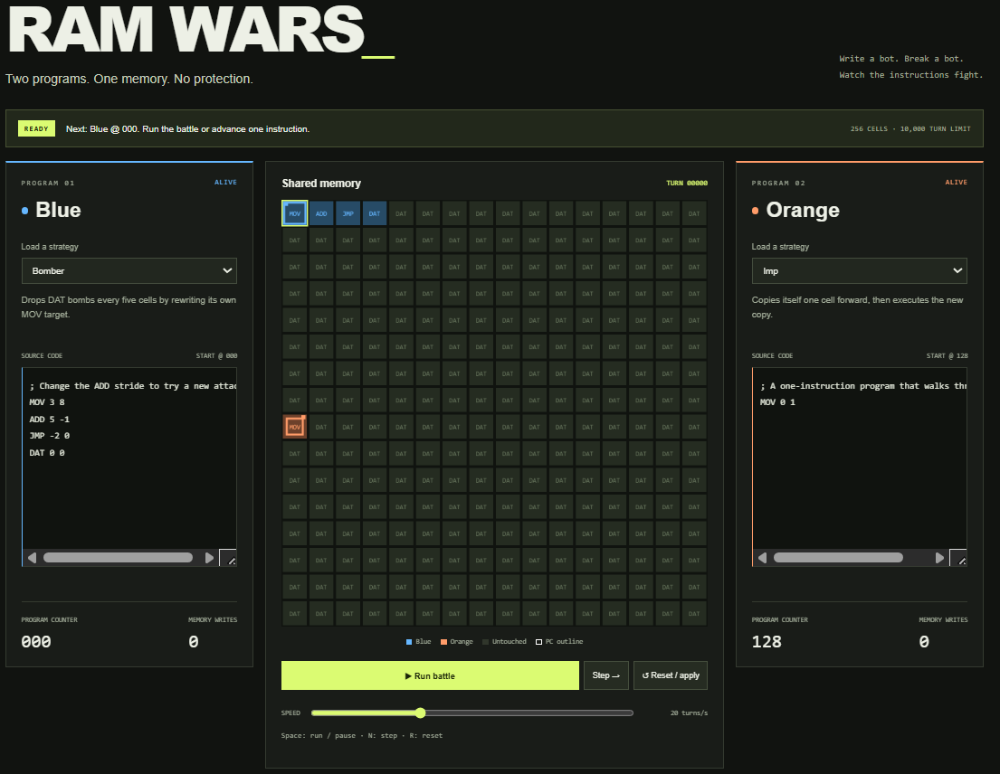
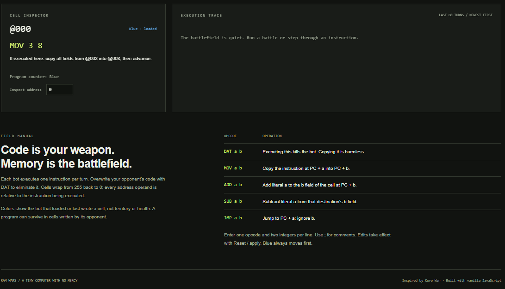

# RAM WARS


**Two programs. One memory. No protection.**

RAM WARS is a browser-based programming game where two assembly bots share a tiny computer—and try to overwrite each other out of existence.

Write a program, load it into the arena, and watch its instructions change the battlefield. A bot can bomb its opponent, copy itself into new memory, or modify its own code to change its strategy. The same memory holds both instructions and data.

Inspired by **Core War**, this project uses a small custom instruction set and an interactive debugger to make every turn understandable.

## Play in seconds

Download or clone the project, then open **`index.html`** in your browser. Keep the `src/` folder and `style.css` next to it.

**No installation, dependencies, or build step required.**

If you prefer a local server, run this from the project directory:

```bash
python -m http.server 8000
```

Then open [localhost:8000](http://localhost:8000). On Windows, you may need `py` instead of `python`.

### Your first match

1. Select **Sniper** for Blue and **Loop** for Orange.
2. Click **Reset / apply** to load both programs.
3. Click **Step** once: Blue overwrites Orange’s starting cell with `DAT`.
4. Click **Step** again: Orange executes `DAT` and loses.
5. Inspect cell **128** to see the instruction and who last wrote it.

For a longer experiment, try **Bomber vs Imp**. Change the bomber’s stride, reset, and compare the result.

## Inside the arena

- **Live memory grid:** all 256 cells, their current opcodes, and both program counters.
- **Editable assembly:** write your own bots or start with five included strategies.
- **Playback controls:** run, pause, single-step, reset, and adjust speed from 1 to 1,000 turns per second.
- **Cell inspector:** examine operands, resolved addresses, the last writer, and the turn of the last write.
- **Execution trace:** follow the latest 60 turns, including jumps, writes, and eliminations.

Blue and orange cells identify the initial loader or most recent writer. Flashes indicate writes; colored outlines mark program counters. Cell colors are not a health score—a bot can execute instructions written by its opponent.

### Controls

| Control | Action |
|---|---|
| Run battle / Pause / Resume | Start or pause automatic execution |
| Step | Execute one bot’s instruction; pause automatic playback |
| Reset / apply | Start a fresh match using both source editors |
| Speed slider | Set the execution rate |
| Click a cell | Inspect its current contents |
| Arrow keys, with the arena focused | Move the inspector through memory |
| Address input | Inspect a specific cell directly |
| `Space` / `N` / `R` | Run or pause / step / reset |

Global shortcuts are inactive while using editors and other form controls. Editing a program pauses the match; apply the edits before continuing. Switching away from the browser tab also pauses automatic execution.

## Battle rules

| Setting | Value |
|---|---|
| Memory | 256 circular instruction cells, initially `DAT 0 0` |
| Program size | 1–128 instructions per bot |
| Starting positions | Blue at `0`, Orange at `128` |
| Turn order | Blue, Orange, Blue, Orange… |
| One turn | One executed instruction |
| Elimination | Execute `DAT` |
| Draw | Both bots survive 10,000 turns |

Death takes priority over the turn limit: a bot dying on turn 10,000 still produces a winner. Fixed starting positions make matches reproducible, and Blue has a first-move advantage.

Memory wraps in both directions: address `256` is `0`, and address `-1` is `255`. There is no memory protection. Bots can overwrite their opponents—or accidentally destroy themselves.

## Write a bot

Each instruction has an opcode and two signed integer operands:

```text
OPCODE a b
```

Opcodes are case-insensitive. Both operands are required, even when ignored. Blank lines are allowed, and `;` starts a comment. This version does not support labels or indirect addressing.

### Instruction set

`PC` below means the program counter **at the start of the current instruction**. Every memory address is wrapped into the valid range.

| Instruction | Operation | Next PC |
|---|---|---|
| `DAT a b` | Kill the executing bot; ignore both operands | Unchanged |
| `MOV a b` | Copy the entire instruction at `PC + a` into `PC + b` | `PC + 1` |
| `ADD a b` | Add literal `a` to the **b field** of the instruction at `PC + b` | `PC + 1` |
| `SUB a b` | Subtract literal `a` from that destination’s **b field** | `PC + 1` |
| `JMP a b` | Jump to `PC + a`; ignore `b` | `PC + a` |

`MOV` creates an independent copy. Copying a `DAT` instruction is harmless; executing it is fatal. Arithmetic changes only the destination’s `b` field, leaving its opcode and `a` field intact.

Addresses wrap, but stored operands do not. Operands must be JavaScript safe integers. Arithmetic that exceeds that range eliminates the bot instead of silently losing precision. Invalid source is rejected before a match; an invalid runtime opcode also eliminates the executing bot.

### Example: a self-modifying bomber

```text
; Copy a bomb, move the target, repeat.
MOV 3 8
ADD 5 -1
JMP -2 0
DAT 0 0
```

Loaded at address `0`, its first three instructions do this:

| PC | Instruction | Effect |
|---|---|---|
| `0` | `MOV 3 8` | Copy the `DAT` at address `3` into address `8` |
| `1` | `ADD 5 -1` | Change cell `0` from `MOV 3 8` to `MOV 3 13` |
| `2` | `JMP -2 0` | Return to address `0` |

The next pass drops a bomb at address `13`, then advances the target again. The program changes its own instruction to decide where to attack next.

Try replacing the stride `5` with `4`, `7`, or a negative number. How does that change which cells the bot visits—and when it hits its own code?

### Included strategies

| Bot | Strategy |
|---|---|
| Bomber | Drop `DAT` bombs while increasing the target address |
| Imp | Repeatedly copy `MOV 0 1` one cell ahead and execute the copy |
| Reverse bomber | Decrease its bombing target using `SUB` |
| Sniper | Target the opposing starting address, 128 cells away |
| Loop | Repeatedly execute `JMP 0 0`; useful as a stationary target |

## How the code is organized

The simulation is independent of the page: it can run in a browser or be tested directly with Node.js.

| File | Responsibility |
|---|---|
| `index.html` | Page structure and ordered script loading |
| `style.css` | Layout, colors, and responsive styles |
| `src/engine.js` | Instructions, bots, parser, execution, and match lifecycle |
| `src/presets.js` | Example bot programs and descriptions |
| `src/app.js` | Controls, animation scheduling, Canvas rendering, and inspection |
| `tests/engine.test.js` | Automated engine tests |

Inside the engine:

- **`Instruction`** stores an opcode and two operands.
- **`Bot`** stores a name, program counter, and alive state.
- **`Executor`** fetches an instruction snapshot, dispatches it through an opcode-handler map, and reports any write.
- **`Game`** alternates bots, records write ownership, and determines the result.

The UI consumes execution events rather than changing simulation memory. At higher speeds, multiple turns run within each animation frame. Work per frame and trace history are bounded to keep playback manageable.

The browser uses deferred classic scripts so the game can open directly from disk. The engine also provides CommonJS exports for testing.

## Tests

With Node.js 18 or newer, run:

```bash
node --test tests/engine.test.js
```

The nine engine tests cover copying and address wrapping, arithmetic, self-modification, turn order, elimination, draws, reset isolation, parser validation, and integer limits.

All nine passed for this version. Control logic was also checked in a simulated DOM. Canvas rendering and responsive layout still require verification in a real browser.

## Ideas for the next version

- Add `JNZ` for conditional control flow.
- Support labels in the assembler.
- Add seeded, non-overlapping random starting positions.
- Run tournaments with alternating first players.
- Record and replay complete battles.

To add an opcode, register it in `OPCODES` and the executor’s handler map, implement its handler, and update the inspector, manual, and tests.

---

Built with **JavaScript, HTML, CSS, and Canvas**. Inspired by **Core War**; implements its own simplified rules rather than the full Redcode specification.
